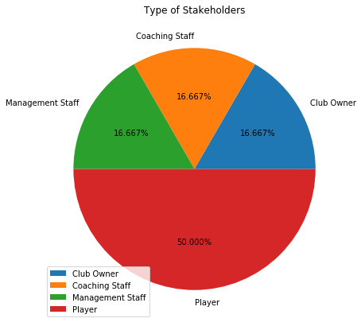

```python
import mysql.connector
import pandas as pd
import matplotlib.pyplot as plt
import seaborn as sns
```


```python
connection = mysql.connector.connect(host = 'localhost', database = 'db_bcci', user = 'root', password = 'abcd1234' )
```


```python
cursor = connection.cursor()
```


```python
query_stakeholder = "select * from stakeholder"
query_player = "select * from player"
query_coachingstaff = "select * from coaching_staff"
query_managementstaff = "select * from management_staff"
query_clubowner = "select * from club_owner"
query_team_sponsor = "select * from team_sponsor"
query_sponsor = "select * from sponsor"
query_match = "select * from `match`"
query_team = "select * from team"
query_stadium = "select * from stadium"

df_stakeholder = pd.read_sql(query_stakeholder, connection)
df_player = pd.read_sql(query_player, connection)
df_cstaff = pd.read_sql(query_coachingstaff, connection)
df_mstaff = pd.read_sql(query_managementstaff, connection)
df_clubowner = pd.read_sql(query_clubowner, connection)
df_team_sponsor = pd.read_sql(query_team_sponsor, connection)
df_sponsor = pd.read_sql(query_sponsor, connection)
df_match = pd.read_sql(query_match, connection)
df_team = pd.read_sql(query_team, connection)
df_stadium = pd.read_sql(query_stadium, connection)

df_stakeholder.head()
```


<div>
<style scoped>
    .dataframe tbody tr th:only-of-type {
        vertical-align: middle;
    }

    .dataframe tbody tr th {
        vertical-align: top;
    }

    .dataframe thead th {
        text-align: right;
    }
</style>
<table border="1" class="dataframe">
  <thead>
    <tr style="text-align: right;">
      <th></th>
      <th>PRSNID</th>
      <th>FIRST_NAME</th>
      <th>LAST_NAME</th>
      <th>DATE_OF_BIRTH</th>
    </tr>
  </thead>
  <tbody>
    <tr>
      <th>0</th>
      <td>P001</td>
      <td>Rohit</td>
      <td>Sharma</td>
      <td>1989-04-12</td>
    </tr>
    <tr>
      <th>1</th>
      <td>P002</td>
      <td>Keiron</td>
      <td>Pollard</td>
      <td>1990-05-10</td>
    </tr>
    <tr>
      <th>2</th>
      <td>P003</td>
      <td>Jasprit</td>
      <td>Bumrah</td>
      <td>1993-06-09</td>
    </tr>
    <tr>
      <th>3</th>
      <td>P004</td>
      <td>Mahendra</td>
      <td>Dhoni</td>
      <td>1986-01-05</td>
    </tr>
    <tr>
      <th>4</th>
      <td>P005</td>
      <td>Ravindra</td>
      <td>Jadeja</td>
      <td>1991-12-03</td>
    </tr>
  </tbody>
</table>
</div>


```python
stakeholder_type = []
for prsnid in df_stakeholder['PRSNID']:
    if prsnid in list(df_player['PRSNID']):
        stakeholder_type.append('Player')
    elif prsnid in list(df_cstaff['PRSNID']):
        stakeholder_type.append('Coaching Staff')
    elif prsnid in list(df_mstaff['PRSNID']):
        stakeholder_type.append('Management Staff')
    elif prsnid in list(df_clubowner['PRSNID']):
        stakeholder_type.append('Club Owner')

df_stakeholder['TYPE'] = stakeholder_type
df_stakeholder.head()
```


<div>
<style scoped>
    .dataframe tbody tr th:only-of-type {
        vertical-align: middle;
    }

    .dataframe tbody tr th {
        vertical-align: top;
    }

    .dataframe thead th {
        text-align: right;
    }
</style>
<table border="1" class="dataframe">
  <thead>
    <tr style="text-align: right;">
      <th></th>
      <th>PRSNID</th>
      <th>FIRST_NAME</th>
      <th>LAST_NAME</th>
      <th>DATE_OF_BIRTH</th>
      <th>TYPE</th>
    </tr>
  </thead>
  <tbody>
    <tr>
      <th>0</th>
      <td>P001</td>
      <td>Rohit</td>
      <td>Sharma</td>
      <td>1989-04-12</td>
      <td>Player</td>
    </tr>
    <tr>
      <th>1</th>
      <td>P002</td>
      <td>Keiron</td>
      <td>Pollard</td>
      <td>1990-05-10</td>
      <td>Player</td>
    </tr>
    <tr>
      <th>2</th>
      <td>P003</td>
      <td>Jasprit</td>
      <td>Bumrah</td>
      <td>1993-06-09</td>
      <td>Player</td>
    </tr>
    <tr>
      <th>3</th>
      <td>P004</td>
      <td>Mahendra</td>
      <td>Dhoni</td>
      <td>1986-01-05</td>
      <td>Player</td>
    </tr>
    <tr>
      <th>4</th>
      <td>P005</td>
      <td>Ravindra</td>
      <td>Jadeja</td>
      <td>1991-12-03</td>
      <td>Player</td>
    </tr>
  </tbody>
</table>
</div>


# Different types of stakeholders in BCCI


```python
df_type_of_stakeholders = df_stakeholder.groupby(['TYPE']).size()

df_type_of_stakeholders.plot(kind = 'pie', 
                             figsize = (7,7), 
                             autopct = '%1.3f%%', 
                             fontsize = 10, 
                             title = 'Type of Stakeholders',
                             legend = True,
                             label = "")
plt.show()
```





# Sponsored Products


```python
df_team_sponsor_product = pd.merge(df_team_sponsor, df_sponsor, how = 'inner', on = 'SPONSORID')

df_team_sponsor_product.head(3)
```


<div>
<style scoped>
    .dataframe tbody tr th:only-of-type {
        vertical-align: middle;
    }

    .dataframe tbody tr th {
        vertical-align: top;
    }

    .dataframe thead th {
        text-align: right;
    }
</style>
<table border="1" class="dataframe">
  <thead>
    <tr style="text-align: right;">
      <th></th>
      <th>SPONSORID</th>
      <th>TEAMID</th>
      <th>SPONSOR_NAME</th>
      <th>PRODUCT</th>
    </tr>
  </thead>
  <tbody>
    <tr>
      <th>0</th>
      <td>S001</td>
      <td>T001</td>
      <td>Reliance Jio</td>
      <td>Telecom</td>
    </tr>
    <tr>
      <th>1</th>
      <td>S001</td>
      <td>T002</td>
      <td>Reliance Jio</td>
      <td>Telecom</td>
    </tr>
    <tr>
      <th>2</th>
      <td>S001</td>
      <td>T003</td>
      <td>Reliance Jio</td>
      <td>Telecom</td>
    </tr>
  </tbody>
</table>
</div>


```python
df_team_sponsor_groupby_product = df_team_sponsor_product.groupby(['PRODUCT'])['TEAMID'].count()
fig = df_team_sponsor_groupby_product.plot(kind='bar', color = 'purple', fontsize = 10, title='Advertised Products', figsize=(8, 8))
fig.grid(axis = 'y')
```


# Team with maximum number of wins


```python
df_match_teams = pd.merge(df_match, df_team, how = 'inner', left_on = 'WINNER', right_on = 'TEAMID')
df_match_teams.head(3)
```


<div>
<style scoped>
    .dataframe tbody tr th:only-of-type {
        vertical-align: middle;
    }

    .dataframe tbody tr th {
        vertical-align: top;
    }

    .dataframe thead th {
        text-align: right;
    }
</style>
<table border="1" class="dataframe">
  <thead>
    <tr style="text-align: right;">
      <th></th>
      <th>MATCHID</th>
      <th>DATE</th>
      <th>TEAMID_1</th>
      <th>TEAMID_2</th>
      <th>TOSS_WIN</th>
      <th>TOSS_DECISION</th>
      <th>WINNER</th>
      <th>STADIUMID</th>
      <th>TEAMID</th>
      <th>TEAM_NAME</th>
      <th>NO_OF_PLAYERS</th>
      <th>BUDGET</th>
    </tr>
  </thead>
  <tbody>
    <tr>
      <th>0</th>
      <td>M001</td>
      <td>2021-04-01</td>
      <td>T001</td>
      <td>T002</td>
      <td>T001</td>
      <td>Ball</td>
      <td>T001</td>
      <td>S001</td>
      <td>T001</td>
      <td>Mumbai Indians</td>
      <td>3</td>
      <td>1000000.0</td>
    </tr>
    <tr>
      <th>1</th>
      <td>M002</td>
      <td>2021-04-02</td>
      <td>T001</td>
      <td>T003</td>
      <td>T003</td>
      <td>Bat</td>
      <td>T001</td>
      <td>S001</td>
      <td>T001</td>
      <td>Mumbai Indians</td>
      <td>3</td>
      <td>1000000.0</td>
    </tr>
    <tr>
      <th>2</th>
      <td>M004</td>
      <td>2021-04-04</td>
      <td>T001</td>
      <td>T004</td>
      <td>T001</td>
      <td>Bat</td>
      <td>T001</td>
      <td>S001</td>
      <td>T001</td>
      <td>Mumbai Indians</td>
      <td>3</td>
      <td>1000000.0</td>
    </tr>
  </tbody>
</table>
</div>


```python
countplt, fig = plt.subplots(figsize = (8,8))
fig = sns.countplot(df_match_teams['TEAM_NAME'], palette = "Set1")
fig.grid(axis = 'y')
fig.set(xlabel = 'Team Name', ylabel = 'Number of matches won', title = 'Number of matches won by IPL Teams')
fig.set_xticklabels(fig.get_xticklabels(), rotation=90)
```


    [Text(0, 0, 'Mumbai Indians'),
     Text(0, 0, 'Sunrisers Hyderabad'),
     Text(0, 0, 'Chennai Super Kings'),
     Text(0, 0, 'Rajasthan Royals'),
     Text(0, 0, 'Delhi Capitals'),
     Text(0, 0, 'Punjab Kings')]


# Studying Mumbai Indians' win over the years


```python
df_match.head(3)
```


<div>
<style scoped>
    .dataframe tbody tr th:only-of-type {
        vertical-align: middle;
    }

    .dataframe tbody tr th {
        vertical-align: top;
    }

    .dataframe thead th {
        text-align: right;
    }
</style>
<table border="1" class="dataframe">
  <thead>
    <tr style="text-align: right;">
      <th></th>
      <th>MATCHID</th>
      <th>DATE</th>
      <th>TEAMID_1</th>
      <th>TEAMID_2</th>
      <th>TOSS_WIN</th>
      <th>TOSS_DECISION</th>
      <th>WINNER</th>
      <th>STADIUMID</th>
    </tr>
  </thead>
  <tbody>
    <tr>
      <th>0</th>
      <td>M001</td>
      <td>2021-04-01</td>
      <td>T001</td>
      <td>T002</td>
      <td>T001</td>
      <td>Ball</td>
      <td>T001</td>
      <td>S001</td>
    </tr>
    <tr>
      <th>1</th>
      <td>M002</td>
      <td>2021-04-02</td>
      <td>T001</td>
      <td>T003</td>
      <td>T003</td>
      <td>Bat</td>
      <td>T001</td>
      <td>S001</td>
    </tr>
    <tr>
      <th>2</th>
      <td>M003</td>
      <td>2021-04-03</td>
      <td>T001</td>
      <td>T005</td>
      <td>T001</td>
      <td>Ball</td>
      <td>T005</td>
      <td>S001</td>
    </tr>
  </tbody>
</table>
</div>


```python
df_mumbai_indians_matches = df_match[(df_match['TEAMID_1']=='T001') | (df_match['TEAMID_2']=='T001')]
df_mumbai_indians_matches.head()
```


<div>
<style scoped>
    .dataframe tbody tr th:only-of-type {
        vertical-align: middle;
    }

    .dataframe tbody tr th {
        vertical-align: top;
    }

    .dataframe thead th {
        text-align: right;
    }
</style>
<table border="1" class="dataframe">
  <thead>
    <tr style="text-align: right;">
      <th></th>
      <th>MATCHID</th>
      <th>DATE</th>
      <th>TEAMID_1</th>
      <th>TEAMID_2</th>
      <th>TOSS_WIN</th>
      <th>TOSS_DECISION</th>
      <th>WINNER</th>
      <th>STADIUMID</th>
    </tr>
  </thead>
  <tbody>
    <tr>
      <th>0</th>
      <td>M001</td>
      <td>2021-04-01</td>
      <td>T001</td>
      <td>T002</td>
      <td>T001</td>
      <td>Ball</td>
      <td>T001</td>
      <td>S001</td>
    </tr>
    <tr>
      <th>1</th>
      <td>M002</td>
      <td>2021-04-02</td>
      <td>T001</td>
      <td>T003</td>
      <td>T003</td>
      <td>Bat</td>
      <td>T001</td>
      <td>S001</td>
    </tr>
    <tr>
      <th>2</th>
      <td>M003</td>
      <td>2021-04-03</td>
      <td>T001</td>
      <td>T005</td>
      <td>T001</td>
      <td>Ball</td>
      <td>T005</td>
      <td>S001</td>
    </tr>
    <tr>
      <th>3</th>
      <td>M004</td>
      <td>2021-04-04</td>
      <td>T001</td>
      <td>T004</td>
      <td>T001</td>
      <td>Bat</td>
      <td>T001</td>
      <td>S001</td>
    </tr>
    <tr>
      <th>4</th>
      <td>M005</td>
      <td>2021-04-05</td>
      <td>T001</td>
      <td>T006</td>
      <td>T006</td>
      <td>Ball</td>
      <td>T001</td>
      <td>S001</td>
    </tr>
  </tbody>
</table>
</div>


```python
df_mumbai_indians_matches['DATE'] = pd.to_datetime(df_mumbai_indians_matches['DATE'], format='%Y-%m-%d')
df_mumbai_indians_matches.dtypes
```

    D:\Anaconda\lib\site-packages\ipykernel_launcher.py:1: SettingWithCopyWarning: 
    A value is trying to be set on a copy of a slice from a DataFrame.
    Try using .loc[row_indexer,col_indexer] = value instead
    
    See the caveats in the documentation: https://pandas.pydata.org/pandas-docs/stable/user_guide/indexing.html#returning-a-view-versus-a-copy
      """Entry point for launching an IPython kernel.
    


    MATCHID                  object
    DATE             datetime64[ns]
    TEAMID_1                 object
    TEAMID_2                 object
    TOSS_WIN                 object
    TOSS_DECISION            object
    WINNER                   object
    STADIUMID                object
    dtype: object


```python
df_mumbai_indians_matches['DATE'] = df_mumbai_indians_matches['DATE'].dt.year
df_mumbai_indians_matches.head(2)
```

    D:\Anaconda\lib\site-packages\ipykernel_launcher.py:1: SettingWithCopyWarning: 
    A value is trying to be set on a copy of a slice from a DataFrame.
    Try using .loc[row_indexer,col_indexer] = value instead
    
    See the caveats in the documentation: https://pandas.pydata.org/pandas-docs/stable/user_guide/indexing.html#returning-a-view-versus-a-copy
      """Entry point for launching an IPython kernel.
    


<div>
<style scoped>
    .dataframe tbody tr th:only-of-type {
        vertical-align: middle;
    }

    .dataframe tbody tr th {
        vertical-align: top;
    }

    .dataframe thead th {
        text-align: right;
    }
</style>
<table border="1" class="dataframe">
  <thead>
    <tr style="text-align: right;">
      <th></th>
      <th>MATCHID</th>
      <th>DATE</th>
      <th>TEAMID_1</th>
      <th>TEAMID_2</th>
      <th>TOSS_WIN</th>
      <th>TOSS_DECISION</th>
      <th>WINNER</th>
      <th>STADIUMID</th>
    </tr>
  </thead>
  <tbody>
    <tr>
      <th>0</th>
      <td>M001</td>
      <td>2021</td>
      <td>T001</td>
      <td>T002</td>
      <td>T001</td>
      <td>Ball</td>
      <td>T001</td>
      <td>S001</td>
    </tr>
    <tr>
      <th>1</th>
      <td>M002</td>
      <td>2021</td>
      <td>T001</td>
      <td>T003</td>
      <td>T003</td>
      <td>Bat</td>
      <td>T001</td>
      <td>S001</td>
    </tr>
  </tbody>
</table>
</div>


```python
countplt, fig = plt.subplots(figsize = (8,8))
fig = sns.countplot(df_mumbai_indians_matches['DATE'], palette = "rocket")
fig.grid(axis = 'y')
fig.set(xlabel = 'YEAR', ylabel = 'Number of matches won', title = 'Number of matches won by Mumbai Indians')
```


    [Text(0, 0.5, 'Number of matches won'),
     Text(0.5, 0, 'YEAR'),
     Text(0.5, 1.0, 'Number of matches won by Mumbai Indians')]


